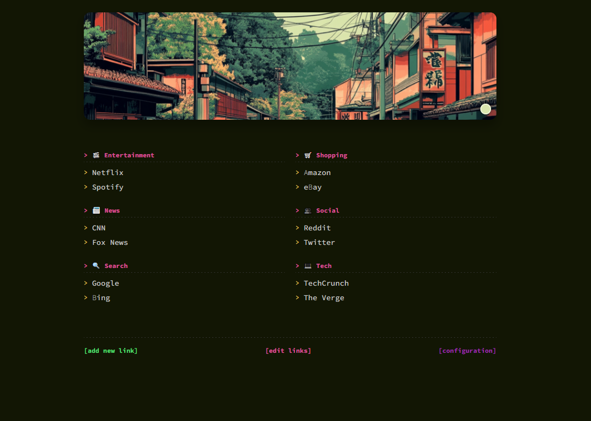

# start:ichi - Minimal Terminal-Style Startpage
[](https://opensource.org/licenses/MIT)
[](https://hub.docker.com/r/dh1011/start-ichi)

A personal startpage with a terminal aesthetic. Organize your bookmarks with a clean, minimalist interface.

## Demo

[](https://youtu.be/DY1OeNu5axg)

## How to Run

### Quick Start
For a full development environment (front and backend):
- Windows: `run_full_dev.bat`
- Unix/Linux/Mac: `./run_full_dev.sh`

### Backend Only
- Windows: `run_dev.bat`
- Unix/Linux/Mac: `./run_dev.sh`

### Frontend Only
- Windows: `run_react_dev.bat`
- Unix/Linux/Mac: `./run_react_dev.sh`

Access the app at http://localhost:5000

## Running with Docker

### Using Docker Compose

The easiest way to run the application is using Docker Compose:

1. Make sure you have [Docker](https://docs.docker.com/get-docker/) and [Docker Compose](https://docs.docker.com/compose/install/) installed on your system.

2. Run the application:
```bash
docker-compose up -d
```

3. The application will be available at `http://localhost:5000`

4. To stop the application:
```bash
docker-compose down
```

### Using Docker directly

Alternatively, you can run the container directly using Docker:

```bash
docker run -d \
  -p 5000:5000 \
  -v data:/app/server/data \
  --name start-ichi \
  dh1011/start-ichi:latest
```

The application will be available at `http://localhost:5000`

To stop the container:
```bash
docker stop start-ichi
docker rm start-ichi
```

## Features

### Category Icons
The app supports the following built-in category icons:
- 🔍 Search
- 🛒 Shopping
- 📰 News
- 💻 Tech
- 🎬 Entertainment
- 👥 Social
- 📁 Uncategorized
- 📌 Default (for any other category)

You can add any category name and it will use the default icon or you can modify the source code to add more icons.

### Smart Local Port URLs
You can add links to local services using just port numbers:
- Enter `:8080` (or any port) in the URL field
- The app will automatically use your current domain/IP with that port
- For example: If you access start:ichi from `192.168.1.10:5000`, then a `:8080` link will open `192.168.1.10:8080`
- Works with any domain you use to access the startpage (localhost, IP addresses, hostnames, etc.)
- Perfect for linking to local development servers, Docker containers, or network services

### Custom Banner Images
You can use any image URL for your banner. The app will:
- Extract the dominant color from your banner
- Apply it to create a matching color theme
- Support the following formats: PNG, JPG, JPEG, GIF, WebP

Example banner URLs can be found in the banners/ directory of the repository:
- https://github.com/dh1011/start-ichi/blob/main/banners/banner%20(1).png
- https://github.com/dh1011/start-ichi/blob/main/banners/banner%20(2).png

You can use any image URL from the web by pasting it in the configuration panel.

## Other Cool Features

- **Moving Banner**: Dynamic banner with clean animations
- **Typing Effect**: Terminal-style typing animation for links
- **Quick Adding Links**: Simple form to add new bookmarks
- **Smart Background**: Automatic theme based on banner colors
- **Color Theme**: Cohesive color scheme across the interface
- **Configurable Banners**: Change your banner and page title easily

## Configuration

Click the `[configuration]` button to:
- Change the banner image URL
- Set a custom page title

## Usage Tips

1. Click `[add new link]` to add a bookmark
2. Enter URL, title, and category
   - For regular websites, use full URLs (e.g., `https://example.com`)
   - For local services, you can use just port numbers (e.g., `:8080`)
3. Click `[edit links]` to modify or delete existing bookmarks
4. Click `[configuration]` to customize the appearance


